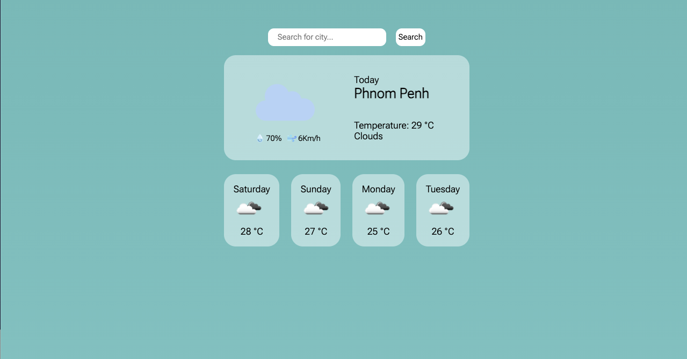
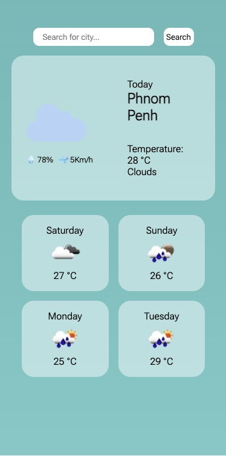

# Weather App project

This is a Weather App project created by **Sopanha Sous** from **Fireflies team**

## About
A weather app that gets user location and fetches the current weather from the OpenWeatherMap API. 

## Features

- Know the temperature of your location
- Know the percentage of humidity, and wind

## Product 

### DeskTop screenshot

### Mobile screenshot

## Installation
1. Clone the repository: `git clone https://github.com/anb-hq/Fireflies-Panha-Weather.git`
2. Install dependencies: `npm install`
3. Run the app: `npm start`

## Usage

- The weather information for the city will be displayed on the your geolocation.
- And then display 4 next days

## Technologies
- OpenWeatherMap API

## Convention Guide

[convention link](/doc/convention.md)