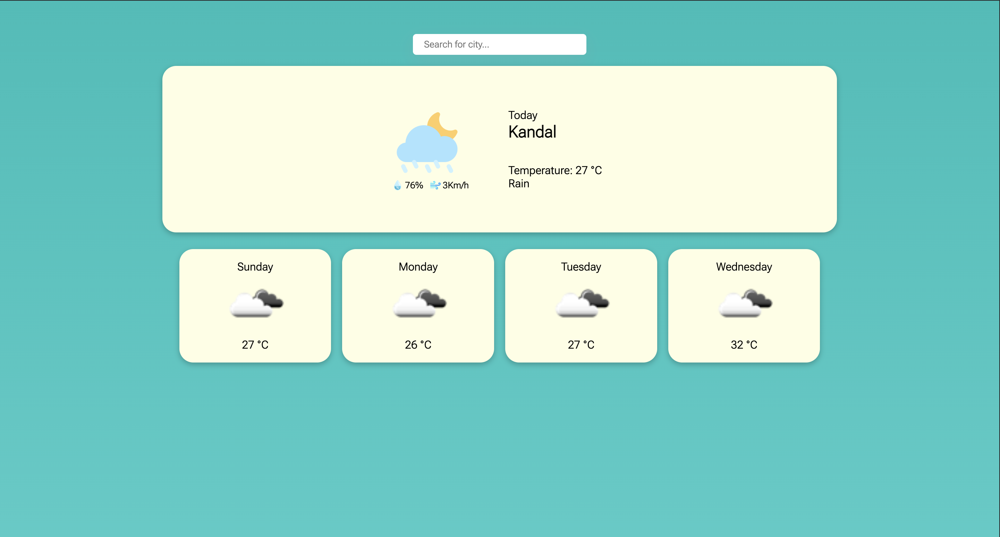

# Weather App project

This is my Weather App project created by **Sopanha Sous** from **Fireflies team**

## About
A weather app that gets user location and fetches the current weather from the OpenWeatherMap API. 

## Features

- Know the temperature of your location
- Know the percentage of humidity, and wind
- Know the weather 4 next days.

## Product Overview

### DeskTop screenshot

### `Display geolocation`

### `Search city name`

### `Display city name`

## Installation
1. Clone the repository: `git clone https://github.com/anb-hq/Fireflies-Panha-Weather.git`
2. Install dependencies: `npm install`
3. Run the app: `npm start`

## Usage

- The weather information for the city will be displayed on your geolocation.
- And then display 4 next days
- About search function you can search by city name, it will drop city name that you want to search. So, you can click on the city name that it drops down it will display whole weather such as geolocation.
    * `Note:` For the search function, it can only know the name of some cities. while some cities name are unknown. I tried to solve this problem as much as possible but only.

## Technologies
- OpenWeatherMap API [link here](https://openweathermap.org/)

## Design UI Screen

Figma Design UI Screen [link here](https://www.figma.com/proto/sa6H9b8VEPC1XkPy62pTv3/Weather-App?type=design&node-id=3-81&t=9FzcrM4PjiYpDrRW-0&scaling=min-zoom&page-id=0%3A1&starting-point-node-id=1%3A3)

## Convention Guide

Convention Guide: [link here](./doc/convention.md)

## Note:

I want to thank you to @Seryvatana he has explained me about the concept of do this weather app and also what he helped me do is responsive css.

Thank You ☺